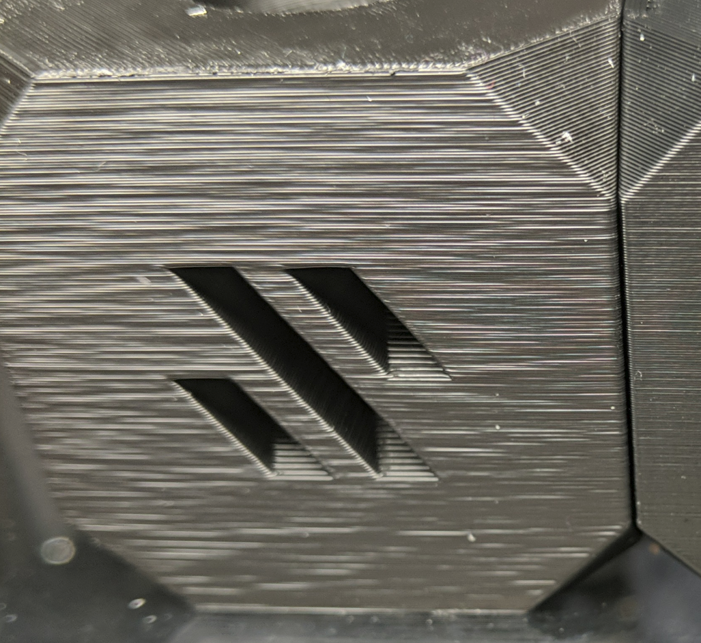
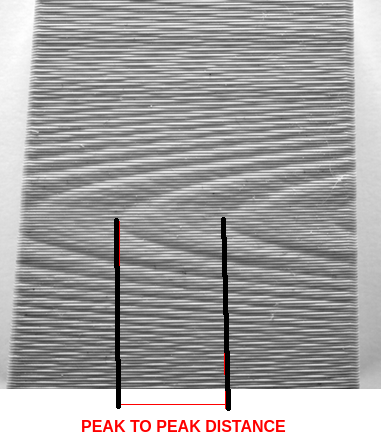
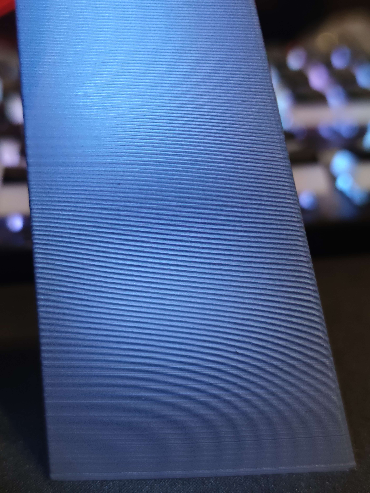

Prints look like this?

This tool aims to help diagnose the source of the issue. I'll leave the theory till the bottom and begin with a walkthrough.
# Setting Expectations

Please do not think, after running this test, and a small adjustment, you will have perfect even walls. Often that is just not possible. I hope people are using this to find the cause of unuseually large and unsightly issues. If you are studying every part with harsh angled light, stop it.
# Step By Step
1) Please download this tower by Mihai Designs:
https://mihaidesigns.com/pages/inconsistent-extrusion-test

2) Slicer settings: Above all else, this needs to be printed in vase mode. Or spiralise outer contour, with no infil, and 1 wall. 0.16 LH and 0.4 LW.

Those using SuperSlicer: Please make sure to input the layer width value in the left column, not the right hand "line spacing" column.

3) Once printed, you should be able to see some woodgrain, as per Mihai's example photos. We are interested in the length of the repeat of this grain effect. The easiest place to measure, would be tip to tip of the grains, as pictured. 

For increased accuracy: you may measure over multiple repeats of the pattern, if possible, and divide by the number of gaps you span. Accuracy is vital here. The difference between patters caused by your motor backlash, and your idler tension, is very small. This is also why i recommend a finer layer height and line width than Mihai. It will stretch the patterns and make them more distinct. Calipers are strongly recommended for this task.

If you see a virtical band, and not woodgrain, proceed to #large format.

4) Enter the peak to peak measurment, into the document here: [https://docs.google.com/spreadsheets/d/1vnIXAw5A0ayoq_EFUgS8qki22nJuo8gVn8SWhKNcVW4/template/preview](https://docs.google.com/spreadsheets/d/1vnIXAw5A0ayoq_EFUgS8qki22nJuo8gVn8SWhKNcVW4/template/preview)
under the "pattern wave length" field, along with your chosen layer height and line width.
For extra precision, please enter your rotation distance from your printer.cfg. This should already be calibrated to give you 100mm when you request 100mm.  See the klipper documents here for help calibrating:
https://www.klipper3d.org/Rotation_Distance.html?h=rotation#calibrating-rotation_distance-on-extruders

5) The value created in red, should be a close match to one of the values in the table below for an extruder running BMG guts.
Given the comparison, with any luck, you now know which gear, or interaction, is causing your inconsistency. A close mechanical inspection, and adjustment, should be able to rectify this.

# Large Format

 For a vertical banding, this indicates very large values between cycles of flow rates. I would suggest printing a simple cylinder in vase mode, of 20mm in diameter and 100-150mm tall. Take note of how much filament the slicer says this will use (volumetric). Make sure to turn off skirts for this value, and any bottom layers; we want a value for the vase portion only. Then you can turn those features back on to print.

 Once printed. You can count the number of cycles. And you know the volumetric flow used to print the tower. Enter these in the appropriate boxes to the right of the spreadsheet and compare to the values below. Guessing at a fractional value, like 4.25 repeats, may increase accuracy.

Currently only BMG gears are directly supported, but please contact me, Weaslus on the voron design or annex engineering discords, if you have other extruders and want help interpreting your results.

# Theory
Words, what are they...
section in progress.

# Thanks
Obviously, the biggest thank you to Mihai Design for pioneering this test print. It has been the inspiration for this tool since the day i first saw it.
I also like to give a shoutout to Foof on the voron discord for creating the initial spreadsheet, and Mazor for just generally being a legend and patient with my and my Github struggles.
